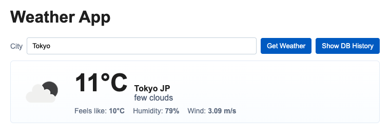
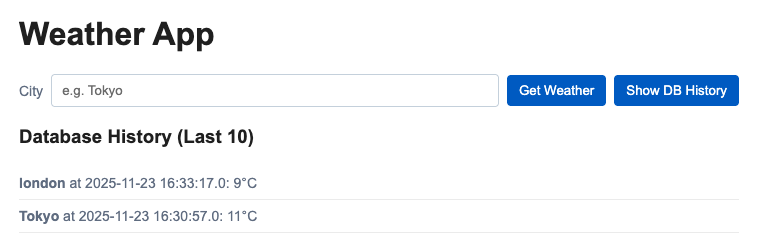

# 天気アプリケーション

フォームに都市名を入力すると、現在の天気情報を表示するアプリケーション。

「Get Weather」



<br>

過去の検索結果を閲覧できる。

「Show DB History」



## 概要

- **フロントエンド**: Apache HTTPD がリバースプロキシとしてリクエストを受け、バックエンドの Tomcat に中継する。
- **バックエンド**: Tomcat 上の Java Servlet (`WeatherServlet`) が OpenWeatherMap API を呼び出し、天気情報を取得する。
- **データベース**: MySQL を使用して、天気情報の検索履歴を永続化する。
- **履歴管理**:
  - 新しい天気を検索すると、結果が履歴としてデータベースに保存される。
  - 同じ都市の履歴が3件を超えると、最も古いデータが自動的に削除される。
- **デプロイ**: `docker-compose` を利用して、すべてのサービス（httpd, tomcat, mysql）をコンテナとして起動する。`tomcat` のイメージビルド時に Java ソースがコンパイルされ、`ROOT.war` としてデプロイされる。

## 事前準備

- OpenWeatherMap の API キー（無料で取得可）: https://openweathermap.org/

## 環境変数

このアプリケーションは、`docker-compose.yml` 内で以下の環境変数を設定して `tomcat` サービスに渡す。

- `WEATHER_API_KEY`: OpenWeatherMap の API キー（**必須**）
- `DB_HOST`: データベースのホスト名 (デフォルト: `mysql`)
- `DB_PORT`: データベースのポート (デフォルト: `3306`)
- `DB_NAME`: データベース名 (デフォルト: `weatherdb`)
- `DB_USER`: データベースのユーザー名 (デフォルト: `weather`)
- `DB_PASSWORD`: データベースのパスワード (デフォルト: `weatherpass`)

## 使い方（ローカル起動）

1. リポジトリのルートに `.env` ファイルを作成し、`WEATHER_API_KEY` を設定する。

2. Docker Compose でビルド＆起動する。

   ```bash
   docker compose up --build -d
   ```

3. ブラウザでアクセスする。

   http://localhost:8000/

   フォームに都市名（例: Tokyo）を入力して「Get Weather」を押すと、天気情報が表示される。また、ページ下部には検索履歴が表示される。

- **データベースの確認**:
  MySQL コンテナに接続してデータを直接確認することも可能である。
  ```bash
  docker compose exec mysql mysql -u weather -pweatherpass weatherdb
  ```
  ```sql
  SELECT * FROM weather_history;
  ```

## 実装メモ

- **サーブレット**: `tomcat/src/WeatherServlet.java`
  - OpenWeatherMap API の呼び出しと、JDBC を介した MySQL への履歴の保存・削除処理を実装している。
- **フロントエンド**: `tomcat/webapp/index.jsp`
  - `fetch` API を使用して `/weather?city=...`（天気取得）と `/weather?action=history`（履歴取得）のエンドポイントを呼び出し、結果を動的に描画する。
- **データベース初期化**: `mysql/init.sql`
  - コンテナ初回起動時に `weather_history` テーブルを作成する。